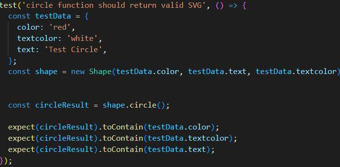

# logo-generator

## Table of Contents

* [Installation](#installation)
* [questions](#questions)
* [LicenseSection](#license-section)
* [test](#test)
* [Description](#description)
* [tools-used](#tools-used)

## Description

logo-generator generates a logo using inquirer to use your terminal as an answer/questions system if you would like to know more about inquirer 
go here https://www.npmjs.com/package/inquirer/v/8.2.4 . 
logo-generator also utilizes file system or filesystem (often abbreviated to fs) which is a method and data structure that the operating system uses to control how data is stored and retrieved. if you would like to know please go here https://en.wikipedia.org/wiki/File_system .
To test whether my javascript methods were working I tested them using jest refer to what I learned for an example.

## what I learned

 * In this project I learned how to use inquirer by downloading and linking it to my page by typing the below
    * `npm install`
    * `npm i inquirer@8.2.4`
    * `const inquirer = require('inquirer')` 
 * I learned how to link javascript functions to seperate pages 
    * `const generateMarkdown = require('./lib/generateShapes')`
 * I learned how to make test using jest
    
    
    
 

## tools used
 
 
 
 

## Installation

* To install logo-generator you need to `git clone git@github.com:Ian-kensington-chadwick-the-3rd/logo-generator.git`.
* Dont forget to install inquirer and jest type `npm i inquirer@8.2.4` and `npm i jest`
* After you have correctly installed Readme.md-generator open up your terminal and type `node index.js`.
* Next answer the questions open up newlogo.svg your file and copy and paste your newley generated logo!
* If you would like to download a demonstration of how to use my logo-generator => 
## Questions

Made by:    

If you have any questions you can reach me at: iansills04@gmail.com

# License Section

 

This project is licensed under the MIT license for more information click on the badge.

rip my code as much as you want If I can help anyone struggling I would be glad, been there done that.
